# WireGuard + V2Ray 双层代理方案

通过 WireGuard 隧道连接云服务器中转节点，再通过 V2Ray 访问上游代理服务器。

## 解决的问题

**痛点：**
- 本地网络出口受限，无法直接连接上游 V2Ray 节点
- 直连上游节点不稳定，延迟高，丢包严重
- 需要频繁切换代理节点

**解决方案：**
- 使用云服务器作为稳定的中转节点
- 通过 WireGuard 建立加密隧道，连接速度快且稳定
- 云服务器到上游节点的连接质量更好
- 只需配置一次 WireGuard，后续可灵活更换上游节点

## 架构说明

```mermaid
graph LR
    A[客户端] -->|WireGuard 隧道| B[云服务器<br/>中转]
    B -->|V2Ray 代理| C[上游服务器]
    C -->|互联网| D[目标网站]
```



## 快速开始

### 前提条件

- 腾讯云 Lighthouse 轻量服务器（Ubuntu22.04-Docker26 镜像）
- 可用的上游 V2Ray 服务器

**推荐配置（已测试通过）：**
- **服务器类型**: 腾讯云 Lighthouse 轻量应用服务器
- **配置**: 2核 4GB 内存
- **系统盘**: 60GB SSD
- **操作系统**: Ubuntu Server 22.04 LTS 64bit
- **带宽**: 200 Mbps

### 依赖检查

在运行脚本前，可以检查必需组件是否已安装：

```bash
# 检查必需组件
which curl unzip jq sshpass bc netstat iptables

# 检查 WireGuard 工具
which wg wg-quick
```

如有缺失，可预先安装：
```bash
sudo apt update
sudo apt install -y curl unzip jq sshpass bc net-tools iptables
```

**推荐云服务商：**
- 🥇 **腾讯云** - 网络环境优秀，部署成功率高，推荐首选（Lighthouse 轻量服务器）

### 配置准备

**重要：在运行脚本前，必须先配置上游服务器信息**

```bash
# 1. 复制配置模板
cp .env.example .env

# 2. 编辑配置文件
vim .env
```

配置 `.env` 文件中的上游服务器信息：
```bash
# 部署服务器
DEPLOY_SERVER_IP=<服务器IP>
DEPLOY_SERVER_USER=<用户名>
DEPLOY_SERVER_PASS=<服务器密码>

# V2Ray 上游服务器配置（必须配置）
UPSTREAM_SERVER=<上游服务器地址>
UPSTREAM_PORT=<端口>
UPSTREAM_USER_ID=<用户ID>
UPSTREAM_ALTER_ID=0
UPSTREAM_SECURITY=auto
UPSTREAM_NETWORK=tcp
UPSTREAM_TLS_SECURITY=tls
UPSTREAM_TLS_SERVER_NAME=<TLS域名>

# 代理启动命令（当网络受限时使用，可选）
PROXY_STARTUP_CMD="sshpass -p '<密码>' ssh -D 1080 -N -f -o StrictHostKeyChecking=no <用户>@<代理服务器>"
```

### 安装步骤

**注意：以下脚本需要在远程云服务器上执行**

#### 方式 1: 一键安装（推荐）

```bash
# 1. 安装 WireGuard
sudo bash wireguard-install.sh -y

# 2. 一键安装 V2Ray（包含透明代理）
sudo bash v2ray-install.sh
```

#### 方式 2: 分步安装

```bash
# 1. 安装 WireGuard
sudo bash wireguard-install.sh -y

# 2. 安装 V2Ray 核心
sudo bash v2ray-install-step1-core.sh

# 3. 启用 TCP 透明代理
sudo bash v2ray-install-step2-enable-tcp-proxy.sh

# 4. (可选) 启用 UDP 透明代理
sudo bash v2ray-install-step3-enable-udp-proxy.sh
```

### 完整部署流程

**腾讯云部署（推荐）:**

```bash
# 1. 配置环境变量（在本地）
cp .env.example .env
# 编辑 .env 填入实际服务器信息

# 2. 从本地上传脚本到远程服务器
scp *.sh .env ubuntu@<服务器IP>:~/

# 3. SSH 登录到远程服务器
ssh ubuntu@<服务器IP>

# 4. 执行主安装
sudo bash wireguard-install.sh
sudo bash v2ray-install.sh

# 5. 退出远程服务器
exit

# 6. 下载配置文件到本地
scp -r ubuntu@<服务器IP>:~/private ./
```

**使用 sshpass 远程执行（需要密码）:**

```bash
# 1. 复制并配置环境变量
cp .env.example .env
# 编辑 .env 填入实际服务器信息

# 2. 加载环境变量
source .env

# 3. 上传脚本和配置
sshpass -p "$DEPLOY_SERVER_PASS" scp -o StrictHostKeyChecking=no *.sh .env $DEPLOY_SERVER_USER@$DEPLOY_SERVER_IP:~/

# 4. 远程执行主安装（-y 参数使用默认配置，无需交互）
sshpass -p "$DEPLOY_SERVER_PASS" ssh -o StrictHostKeyChecking=no $DEPLOY_SERVER_USER@$DEPLOY_SERVER_IP "sudo bash ~/wireguard-install.sh -y"
sshpass -p "$DEPLOY_SERVER_PASS" ssh -o StrictHostKeyChecking=no $DEPLOY_SERVER_USER@$DEPLOY_SERVER_IP "sudo bash ~/v2ray-install.sh"

# 5. 下载配置文件
sshpass -p "$DEPLOY_SERVER_PASS" scp -o StrictHostKeyChecking=no -r $DEPLOY_SERVER_USER@$DEPLOY_SERVER_IP:~/private ./
```

**注意**: 
- sshpass 远程执行方式需要安装 `sshpass`（macOS: `brew install sshpass`，Ubuntu: `apt install sshpass`）
- `wireguard-install.sh -y` 使用默认配置（端口 51820，网段 10.0.8.0/24，2 个客户端）
- 可使用 `--add-client` 参数动态添加更多客户端（最多 31 个）
- 如需自定义配置，请使用腾讯云部署方式

## 功能特性

### 自动化部署
- 一键安装脚本，无需手动配置
- 支持腾讯云 Lighthouse 环境
- 智能环境检测和适配
- 完整的错误处理和回滚机制

### WireGuard VPN
- 高性能加密隧道
- 自动生成服务器和客户端配置
- 支持多客户端（最多 31 个）
- 动态添加客户端功能
- 自动安装必要工具（jq、sshpass 等）

### V2Ray 代理
- SOCKS5 代理（端口 7890）
- 智能路由（国内直连，国外代理）
- Docker/Google/YouTube 域名代理
- 配置文件语法验证
- 从 .env 文件读取上游服务器配置

### 透明代理
- **TCP 透明代理**: 自动代理 HTTP/HTTPS 流量
- **UDP 透明代理**: 支持 QUIC、DNS 等 UDP 应用

## 客户端使用

### 1. 连接 WireGuard
- 安装 WireGuard 客户端
- 导入 `private/client1.conf` 配置文件
- 连接 VPN

### 2. 验证代理
```bash
# 查看出口 IP
curl ip-api.com
# 应显示上游服务器的 IP
```

## 配置说明

### 默认配置

- **WireGuard 端口**: 51820 (UDP)
- **VPN 网段**: 10.0.8.0/24
- **SOCKS5 端口**: 7890
- **TCP 透明代理端口**: 60001
- **UDP 透明代理端口**: 60002

### 防火墙

云服务器安全组需要开放：
- **UDP 51820**: WireGuard

## 常用命令

```bash
# 查看 WireGuard 状态
sudo systemctl status wg-quick@wg0
sudo wg show

# 添加新客户端
sudo bash wireguard-install.sh --add-client      # 添加 1 个客户端
sudo bash wireguard-install.sh --add-client 3    # 添加 3 个客户端

# 查看 V2Ray 状态
sudo systemctl status v2ray

# 查看透明代理规则
sudo iptables -t nat -L V2RAY -n -v
sudo iptables -t mangle -L V2RAY_MARK -n -v
```

## 详细文档

- [腾讯云部署指南](docs/DEPLOYMENT-TENCENT.md) ⭐ **推荐**（Lighthouse 轻量服务器）
- [WireGuard 安装指南](docs/WIREGUARD-SETUP-GUIDE.md)
- [V2Ray 一键安装指南](docs/V2RAY-INSTALL.md)
- [V2Ray 核心安装指南](docs/V2RAY-INSTALL-STEP1-CORE.md)
- [TCP 透明代理指南](docs/V2RAY-INSTALL-STEP2-ENABLE-TCP-PROXY.md)
- [UDP 透明代理指南](docs/V2RAY-INSTALL-STEP3-ENABLE-UDP-PROXY.md)

## 注意事项

- 注意中继服务器和上游服务器的流量限制

## 联系方式

- Email: pholex@gmail.com

---
最后更新: 2025-12-13
